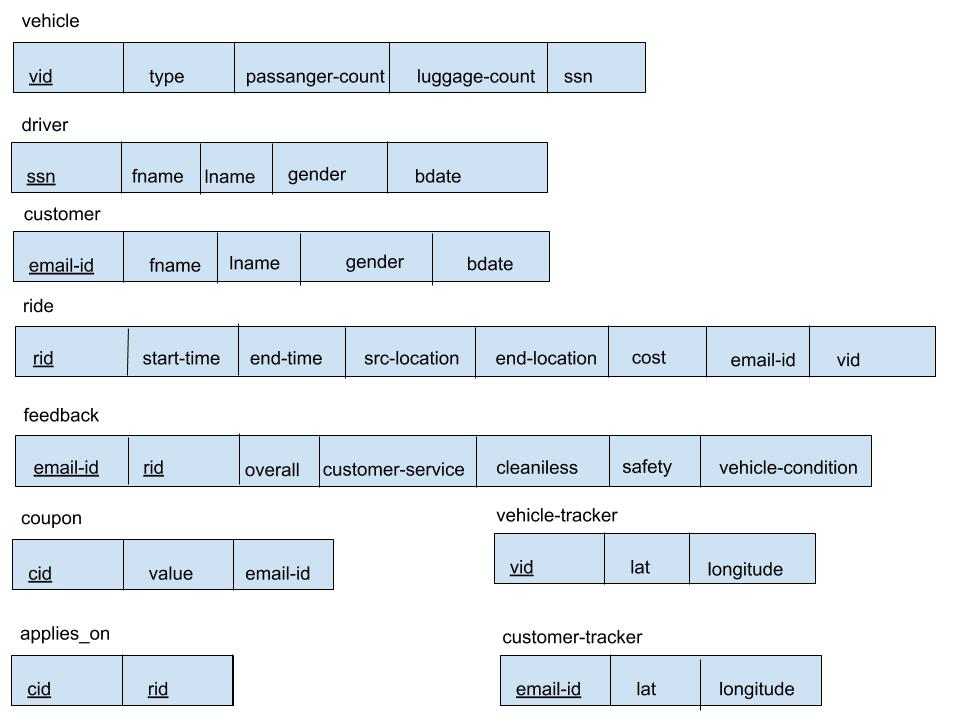

## Introduction

In this project, we designed and implemented a simplified taxicab system. In this taxicab system, there are some requirements: 1) Vehicles are identified by a vehicle-id, 2) each vehicle is owned by a driver, 3) customers are identified by email-id, 4) Customer and vehicle are tracked by GPS, 5) Customer can request a ride with specific vehicle, and give feedback to the ride, 6) Customer can apply coupons to a ride. Based on these requirements, we have the database design as follows.

## Database Design

1. ER diagram
 


2. Mapping ER to relational model



3. Our relational model satisfies 3NF

   The general form for 3NF violation is Key -> Not Key -> Not In Key, in our relational model, there is no this violation, and there is no transitive functional dependency. All non-key attributes are fully dependent only on the primary key. 

4. Specific design choices
	
	Vehicles and customers are tracked using GPS, we create two entities, customer_tracker and vehicle_tracker to address this requirement instead of adding GPS as an attribute. In vehicle_tracker table, we use vehicle_id as the foreign key referenced to vehicle, and loaction(latitude, longitude) as the attribute. In customer_tracker table, we use email_id as the foreign key referenced to customer, and loaction(latitude, longitude) as the attribute.


## Implementation

We designed 5 SQL queries which can be run on our front-end and list the dataset. These queries have joins among tables and aggregate functions, such as Count, Avg.

- Select all the male drivers fname and lname whose vehicle type is SUV.

```sql
    select driver.fname from driver, vehicle where vehicle.dssn = driver.ssn and vehicle.type = 'SUV'
```

- Find the number of drivers who were born after ?12-01-2000?.

```sql
    select fname, count(*) from driver where driver.bdate > '12-01-2000' group by fname
```

- Find the average overall scores of the rides for customers were born after ?12-01-2010?

```sql
    select cost, avg(feedback.overall)
      from feedback, ride, customer
      where feedback.ride_id = ride.rid and
        ride.c_mail = customer.email_id and
        customer.bdate > '12-01-2010'
      group by cost
```

- Retrieve the customers who apply more than 1 coupon to rides  

```sql
    select fname, count(*)
      from customer, coupon, applies_on
      where coupon.customer_email = customer.email_id and
            applies_on.coupon_id = coupon.cid and
            customer_email in (select customer_email from coupon
                               group by customer_email
                               having count(*) > 1)
      group by fname
```

- Retrieve locations of vehicles, whose luggage_count > 4

```sql
    select lat, longitude
      from vehicle_tracker, vehicle
      where vehicle_tracker.vehicle_id = vehicle.vid
      and vehicle. luggage_count > 4
```


## Limitation and future work

Our taxicab test database is not very large, in the future we could enlarge the records to million size, and try to use "Create Index" to create an index on some column in one table, evaluate the amount of time that our system takes to execute the queries, and do some comparison with the amount of time without using index.
 


